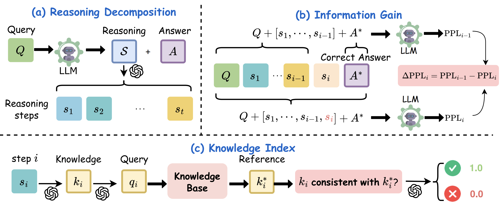

<p align="center">
<h1>Knowledge 📖 or Reasoning 🤔? A Close Look at How LLMs Think Across Domains</h1>
</p>

<div align="center">
  <a href="https://ucsc-vlaa.github.io/ReasoningEval/"></a>  
  <a href="https://arxiv.org/abs/2506.02126"></a>  
</div>

<p align="center">
<a href="https://chtholly17.github.io/" target="_blank">Juncheng Wu*</a>, 
<a href="https://shengliu66.github.io/" target="_blank">Sheng Liu*</a>, 
<a href="https://www.haqtu.me/" target="_blank">Haoqin Tu*</a>, 
<a href="https://openreview.net/profile?id=~Hang_Yu14" target="_blank">Hang yu*</a>, 
<a href="https://xk-huang.github.io/" target="_blank">Xiaoke Huang</a>, 
<a href="https://www.james-zou.com/" target="_blank">James Zou</a>, 
<a href="https://cihangxie.github.io/" target="_blank">Cihang Xie</a>, 
<a href="https://yuyinzhou.github.io/" target="_blank">Yuyin Zhou</a>
</p>

## ⚡️ Introduction



In this work, we propose a fine-grained evaluation framework include two novel step-by-step metrics for LLMs reasoning: 

1. Knowledge Index (KI): the correctness of the **knowledge** used
2. Information Gain (Info Gain): the quality of the **reasoning**.

## 🚀 Quick Start

- **Setup:** Install the condo environment from `environment.yml`
- **Reasoning Decomposition:** call the function [`llm_decompose_reasoning`](https://github.com/UCSC-VLAA/ReasoningEval/blob/c04017ec76856653f9c335b141bb30ccf0545a21/utils.py#L214C5-L214C28)  in `utils.py` 
- **Info Gain:** refer to [`InformationGainScorer`](https://github.com/UCSC-VLAA/ReasoningEval/blob/c04017ec76856653f9c335b141bb30ccf0545a21/metrics.py#L277) class in `metrics.py`
- **Knowledge Index: **refer to [`RetrievalScorer`](https://github.com/UCSC-VLAA/ReasoningEval/blob/c04017ec76856653f9c335b141bb30ccf0545a21/metrics.py#L277) class in `metrics.py`

#### Example Code:

```python
# reasoning decomposition
# reasoning_steps = llms_output_reasoning
decomposed_steps = utils.llm_decompose_reasoning(reasoning_steps)

# init the metrics
retrieval_scorer = RetrievalScorer()
information_gain_scorer = InformationGainScorer(model_name='Qwen/Qwen2.5-7B')

# metrics calculation
KI = retrieval_scorer.forward(decomposed_steps)
InfoGain = information_gain_scorer.forward(decomposed_steps)
```

## 🙏🏼 Acknowledgement

This work was partially funded by an unrestricted gift from Google. We thank the Microsoft Accelerate Foundation Models Research Program for supporting our computing needs.

We gratefully thank the [MedRAG](https://github.com/Teddy-XiongGZ/MedRAG) for the knowledge retrieval model and toolkit!

## 📖 Citation

```
@misc{wu2025knowledgereasoningcloselook,
      title={Knowledge or Reasoning? A Close Look at How LLMs Think Across Domains}, 
      author={Juncheng Wu and Sheng Liu and Haoqin Tu and Hang Yu and Xiaoke Huang and James Zou and Cihang Xie and Yuyin Zhou},
      year={2025},
      eprint={2506.02126},
      archivePrefix={arXiv},
      primaryClass={cs.CL},
      url={https://arxiv.org/abs/2506.02126}, 
}
```

